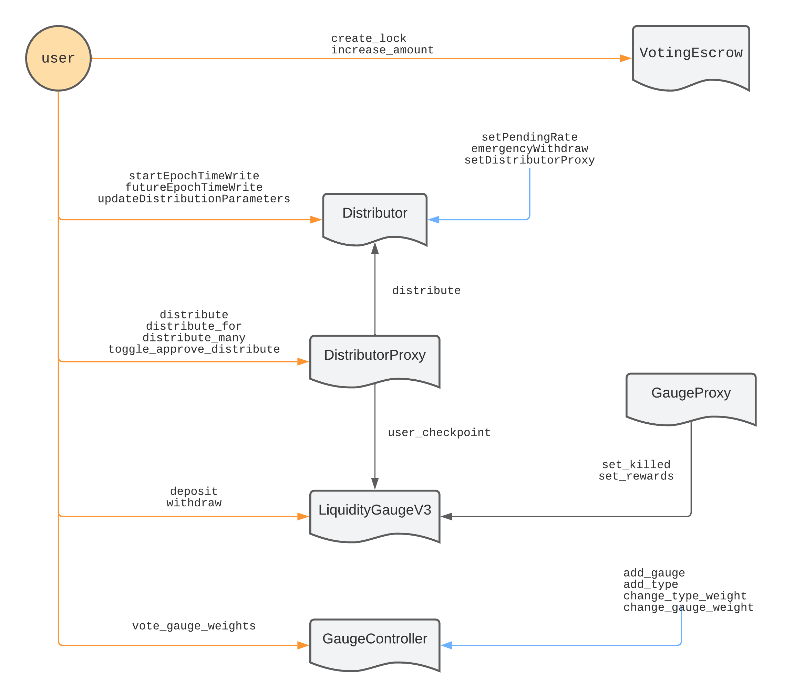

# Idle Gauges contracts

## Overview

## Distributor

The `Distributor` contract is used to distribute rewards across epochs. Epochs have a length of one week and the total amount of rewards to be distributed in a given epoch (or week) can be changed during previous epoch (or week).

It is an `Ownable` contract that will be owned by the governance.

### Setting rewards

Initial distribution rate is to be decided by the IIP that will describe the Gauge system and will be the same until the method `setPendingRate(uint256)` is called.